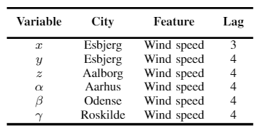
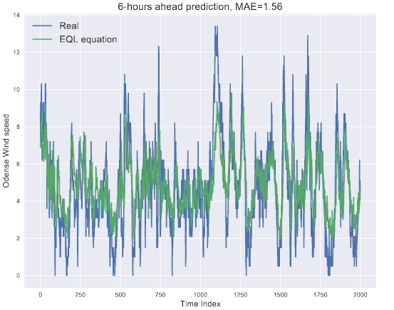

🌀 Symbolic regression for scientific discovery: an application to wind speed forecasting
========
This project aims to perform symbolic regression to discover the governing equations of hourly wind speed for Danish cities. The original paper can be found at: https://arxiv.org/abs/2102.10570

📊 Results
-----
Some tables of the discovered analytical equations as well as the meaning of each important weather feature.

.. figure:: images/extracted_analytical_expressions.PNG
|

|

Some plots of the real vs. the prediction from the formulas given above:

|

|

💻 Installation
-----

The required modules can be installed  via:

.. code:: bash

    pip install -r requirements.txt

Quick Start
~~~~~~~~~~~
To train the EQL model using the two phases, please run:

.. code:: bash

    python train.py
    
For the second phase only, please run:

.. code:: bash

    python train_phase_two.py
    
📂 Data
-----

You can find the link to download the data in the paper. For more info about the data, please write to the following address:

i.alaouiabdellaoui@student.maastrichtuniversity.nl

🔗 Citation
-----

If you decide to cite our project in your paper or use our data, please use the following bibtex reference:

.. code:: bibtex

    @article{abdellaoui2021symbolic,
  title={Symbolic regression for scientific discovery: an application to wind speed forecasting},
  author={Abdellaoui, Ismail Alaoui and Mehrkanoon, Siamak},
  journal={arXiv preprint arXiv:2102.10570},
  year={2021}
    }
    
